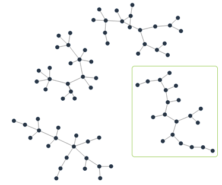
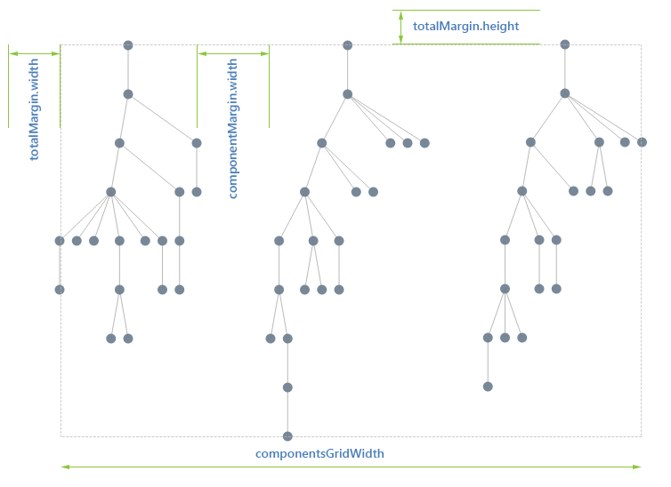
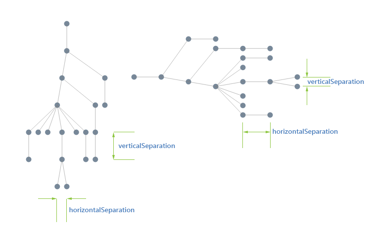
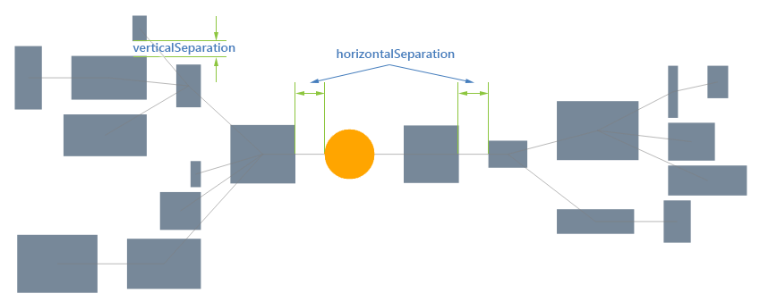
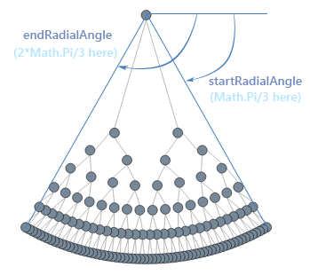
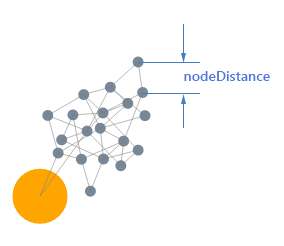

# Math and related 

Kendo diagram contains various structures and utilities related to transformations of visuals, geometry, graph analysis and graph layout. A detailed explanation of all structures and methods would go well beyond the scope of this help, you can find additional information in these sources:

-  [the official SVG 1.1 documentation](http://www.w3.org/TR/SVG/coords.html "the official SVG 1.1 documentation")
-  [graph drawing and graph analysis on Wikipedia](http://en.wikipedia.org/wiki/Graph_drawing "Graph drawing and graph analysis")
-  [an introduction to networks](http://www.amazon.com/Networks-An-Introduction-Mark-Newman/dp/0199206651/ "An introduction to networks")
-  [introductory graph theory](http://www.amazon.com/Introductory-Graph-Theory-Gary-Chartrand/dp/0486247759 "Introductory graph theory")
-  [graph drawing: algorithms for the visualization of graphs](http://www.amazon.com/Graph-Drawing-Algorithms-Visualization-Graphs/dp/0133016153 "Graph drawing: algorithms for the visualization of graphs")

## HashTable

Represents a collection of key-value pairs (called buckets) stored in a classic array with the hash of the key used to identify uniquely the buckets. Because the buckets are accessed through their hash value it's important you use the appropriate add/remove methods to access them.

Internally the buckets look like

	[hashOfKey] <=> {key: givenKey, value: givenValue }

and you can add, remove or retrieve these like so

	var ht = new HashTable();
	ht.add(givenKey, givenValue);
	var obj = ht.get(givenKey);
	var theValue = obj.value;
	ht.remove(givenKey);

where the key and value can be arbitrary values or objects.

### add
Adds a key-value pair to the table. The key/value can be objects or values (number or string). Adding a pair with an existing key will overwrite the stored object.
### set
Sets or adds the key-value pair.
### get
Returns the bucket (not the value) with the given key. No exception is thrown if the key is not present, null is returned.
### remove
Removes the bucket with the given key (see the example code above). No exception is thrown if the key is not present.
### containsKey
Returns whether the given key exists in the table.
### forEach
Loops over the buckets in the hashtable (the key/value are not given as parameters but as one key-value object!).

	ht.forEach(function(obj){
		var key = obj.key;
		var value = obj.value;
 	})

###clone
Returns a (shallow) clone of the HashTable.
  
## Set

A set only contains once a particular item, contrasting other data structure allowing repeated occurrences. 

	var set = new Set();
	set.add("some element");
	set.add("some element"); // will not be added since items in a set appear only once
	
You can pass a Dictionary or a HashTable in the constructor, it will populate the Set with the key-value buckets defined by these structures;

	var dic = new Dictionary();
	dic.add("k1", "Telerik");
	var set = new Set(dic);
	set.forEach(
		function(kv){
			var key = kv.key; // "k1"
			var value = kv.value; // "Telerik"
		}
	);
The Set structure is based internally on the HashTable and thus has the same characteristics. The Set specific methods are the following;

### toArray
Returns an array of the elements contained in the Set.

### forEach
The for-each loops over the items and not the buckets as is the case with the HashTable. Internally the Set items are both key and value of a key-value pair of the HashTable.

## Dictionary

The dictionary or map is a key-value store where the key is unique. In practice a dictionary is more common than a HashTable but they share a lot of functionality, the Dictionary is in fact based on the HashTable.

The add/remove/set methods are similar to the HashTable, the Dictionary adds to this;

### forEachKey

A loop over the keys of the dictionary.

	var dictionary = new Dictionary();
	dictionary.forEachKey(function(key){...});

### forEachValue

A loop over the values in the dictionary.

	var dictionary = new Dictionary();
	dictionary.forEachValue(function(value){...});

### forEach
Loops over the key-value pairs, handed over as paramters;

	var dictionary = new Dictionary();
	dictionary.forEach(function(key, value){...});

### keys
Returns an array of the dictionary keys.

## Queue

The queue is a first-in first-out structure with objects being added using the Enqueue method and objects being fetched through the Dequeue method.  Only the top objects in the queue can be fetched.

### Enqueue

Enqueues an objects in the queue.

### Dequeue

Fetches the top-most item from the queue.

## Range

The Range object is effectively an array of equally separated numbers. This separation defaults to either one in case the start-value is less than the stop-value or minus one otherwise.

    var r1 = new diagram.Range(10, 20); // the array [10, 11, .., 20]
    var r2 = new diagram.Range(20, 10); // the array [20, 19, .., 10]
    var r3 = new diagram.Range(20, 10, -2); // the array [20, 18, .., 10]

## Matrix

The Matrix object is an abstraction of the transformation matrix as used in SVG. The 3x3 matrix contains only six elements which are denoted by `a, b, c, d, e, f` and are organized as
    
    |a c e|
    |b d f|
    |0 0 1|
    
This means that the matrix can also be represented a 6-tuple or vector `[a, b, c, d, e, f]` which you can create using the MatrixVector class. Various methods are available which allow you to go back and forth between these two classes.

Special cases of the Matrix and MatrixVector are:

      |1 0 tx|
      |0 1 ty|  <=> [1 0 0 1 tx ty] <=> translation (tx, ty)
      |0 0  1|

      |sx 0 0|
      |0 sy 0|  <=> [sx 0 0 sy 0 0] <=> scaling (sx, sy)
      |0  0 1|

      |cos(a) -sin(a) 0|
      |sin(a) cos(a)  0|  <=> [cos(a) sin(a) -sin(a) cos(a) 0 0] <=> roation with angle a (radians)
      | 0      0      1|

### plus
Adds another matrix to the current one, i.e. the standard matrix addition. This modifies the current matrix and does not return a new instance.

### minus
Substracts the given matrix from the current one, i.e. the standard matrix substraction. This modifies the current matrix and does not return a new instance.

### times
Returns the result of multiplying the current matrix with another one. Note that the supplied matrix has to be transformation Matrix.

### apply
Applies the current transformation to the given 2D-point, thus returning the transformed point.

### toString
Returns a string representation in a form which can be used in SVG, i.e. "matrix(...)".

## Node

A node or vertex can be a stand-alone object or part of a Graph structure. You can instantiate a Node as follows:

    var node = kendo.diagram.Node();

or with a specific identifier as

    var node = kendo.diagram.Node("myId");

A Node has three collections defined which hold the incidence structure of a Graph but which can be also used outside the Graph:

 * the **links** array holds all the links attached to the Node
 * the **outgoing** array holds all the links starting at the Node (i.e. the Node is always the **source** of these links)
 * the **incoming** array holds all the links ending at the Node (i.e. the Node is always the **target** of these links)

You normally only use these array to inspect their content but use the appropriate methods of the Node, the Link or Graph object which automatically manage these collections.
For example, the creation of a new link

    var link = new kendo.diagram.Link(a,b);

will automatically add this link to the outgoing collection of the 'a' node and to the incoming collection of the 'b' node.

### isIsolated
Returns whether this node has no links attached and thus disconnected from other nodes.

### is LinkedTo
Returns whether there is at least one link with the given (complementary) node. This can be either an incoming or outgoing link.

### getChildren
Gets the children of this node, defined as the adjacent nodes with a link from this node to the adjacent one.

###getParents
Gets the parents of this node, defined as the adjacent nodes with a link from the adjacent node to this one.

### clone
Returns a clone of the Node. Note that the identifier is not cloned since it's a different Node instance.

### adjacentTo
Returns whether there is a link from the current node to the given node.

### removeLink
Removes the given link from the link collection this node owns.

### hasLinkTo
Returns whether there is a (outgoing) link from the current node to the given one.

### degree
Returns the degree of this node, i.e. the sum of incoming and outgoing links.

### incidentWith
Returns whether this node is either the source or the target of the given link.

### getLinksWith
Returns the links between this node and the given one.

### getNeighbors
Returns the nodes (either parent or child) which are linked to the current one.

##Link

A link is always directed and is defined by its **source** (aka origin, 'from' endpoint, start vertex or start node) and **target** (aka sink, 'to' endpoint, end vertex or end node);

    var from = new Node("from");
    var to = new Node("to");
    var link = new Link(from, to);

### getComplement

Return the opposite node in the link of the given node or null if the given node is not part of the link

    var from = new Node("from");
    var to = new Node("to");
    var link = new Link(from, to);
	var opposite = link.getComplement(from); // returns the "to" node
	var nothing = link.getComplement(new Node()) // returns null

### getCommonNode

Returns the overlap (i.e. overlapping node) of the current link with the given one, or null if none.

### isBridging

Returns whether the current link is bridging the given nodes, i.e. whether the given nodes correspond to the source and target of the current link.

	var from = new Node("from");
    var to = new Node("to");
    var link = new Link(from, to);
	var isBridging = link.isBriding(from, to); // returns true

### getNodes
Returns the source and target of this link as a tuple (array of two elements).

	var from = new Node("from");
    var to = new Node("to");
    var link = new Link(from, to);
	var tuple = link.getNodes(); // returns [from, to]

### incidentWith

Returns whether the given node is either the source or the target of the current link.

### adjacentTo

 Returns whether the given link is a continuation of the current one. This can be both via an incoming or outgoing link. 

### changeSource

Changes the source-node of the link. It preserves the identifier of the link but effectively changes the incidence structure; incoming and other collections are internally changed through this method.

### changeTarget

Similar to the changeSource method, it changes the target-node of the link.

### changeNodes

A combination of the changeSource and changeTarget methods; it replaces the source and target nodes of the current link.

### reverse

Reverses the direction of the (directed) link, thus inverting the roles of source and target nodes.

### clone

Returns a clone of the current link which consists of the same instance of the source and target node but different properties (identifier, weight and so on).

### createReverseEdge

Returns a clone of the current link with the reversed direction.

## Graph

The graph structure implements the classic mathematical object comprised of nodes and links. Nodes are uniquely identified inside the graph by means of their identifier (id). Links are
 in essence just 2-tuples of nodes.
You can define graphs explicitly by means of the API methods or via the so-called linearized form (which is a serialization of the graph containing only the essential adjacency structure).

Using the API you can build up a graph as follows:

     var g = new diagram.Graph("G1"); // specifying an identifier 'G1'
     var h = new diagram.Graph(); // auto-assigned identifier

     var n1 = g.addNode("n1"); // a new node with identifier "n1"
     var n2 = g.addNode(); // node with auto-identifier

     var link = g.addLink("n1", n2); // you can use identifiers or objects to specify the source and target of a link

Using the linearized version of a graph you could more easily define the previous graph as:

     var g = kendo.diagram.Graph.parse(["1->2"]);

Conversely, you can linearize an existing graph:

     var shortForm = g.linearize();

There are various options when using these methods, see below for more details.

The relational (often called 'adjacency') structure of the graph is internally not defined by means of linked lists or an adjacency matrix, rather each node defines three collections

- the **incoming links**: links with the target equal to the node
- the **outgoing links**: links with the source equal to the node
- all the **links**: all links attached to the node

which overdefines the topology of the graph but alleviates the development of algorithms. In most circumstances you don't access or update these collections but rather make use of the appropriate methods (add, remove...) which internally maintain these link collections.

#Predefined and random graphs

Besides the linearized format which makes it easy to create diagrams the framework also defines a few predefined graphs and some methods generating random diagrams.

The predefined graphs are:

- **Mindmap**: a typical mindmap diagram.
- **EightGraph**: a graph with some cycles.
- **ThreeGraph**: a simple graph with three nodes
- **Workflow**: a typical workflow diagram (with cycles)

There is a simple method which turns a Graph into a diagram as follows:

	// assuming 'diagram' is the name of the Kendo diagram control instance
 	var graph = kendo.diagram.Graph.Predefined.Mindmap();
	kendo.diagram.Graph.Utils.createDiagramFromGraph(diagram, graph);

The **createDiagramFromGraph** method also has an optional final boolean parameter which turns layout on or off. If you specify

	kendo.diagram.Graph.Utils.createDiagramFromGraph(diagram, graph, true);

the force-directed layout will be applied after the diagram has been generated.

To generate random diagram you can use the randomDiagram method directly on the control instance

	 diagram.randomDiagram(50, 3, true);

which will generate a random tree diagram with 50 nodes, a maximum incidence (i.e. degree) of three. The last parameter specified whether the random diagram should be a tree. If set to false it means there are potentially cycles.
You can also use the following methods from the utilities:

- **createBalancedTree**: creates a balanced tree (all nodes have the same degree)
- **createBalancedForest**: creates a forest of balanced trees
- **createRandomConnectedGraph**: creates a connected graph (optionally a tree).

These methods are aliased in the Predefined class too, so you can create a balanced forest like so

	var g = kendo.diagram.Graph.Predefined.Forest(3, 2, 3); // 3 levels, degree two, three trees
	var useRandomSizes = true; // create nodes or shapes with random width and height
    kendo.diagram.Graph.Utils.createDiagramFromGraph(diagram, g, false, useRandomSizes);

#Layout

The layout of a diagram consists in arranging the shapes (sometimes also the connections) in some fashion in order to achieve an aesthetically pleasing experience to the user. It aims at giving a more direct insight in the information contained within the diagram and its relational structure.

On a technical level, layout consists of a multitude of algorithms and optimizations:

* analysis of the relational structure (loops, multi-edge occurence...)
* connectedness of the diagram and the splitting into disconnected components
* crossings of connections
* bends and length of links

and various ad-hoc calculations which depend on the type of layout. The criteria on which an algorithm is based vary but the common denominator is:

* a clean separation of connected components (subgraphs)
* an orderly organization of the shapes in such a way that siblings are close to another, i.e. a tight packing of shapes which belong together (parent of child relationship)
* a minimum of connection crossings

Kendo diagram includes three of the most used layout algorithms which should cover most of your layout needs:

* **tree layout**: organizes the diagram in an hierarchical fashion and articulating the well-know organizational charts. This type includes the radial tree layout, mindmapping and the classic tree diagrams.
* **force-directed layout**: organizes the diagram in a non-predictable, organic fashion on the basis of physical principles. The strength of this layout resides in the fact that it applies to arbitrary diagram where certain assumption are not known to be valid a priori, like e.g. whether it's connected or hierarchical.
* **layered layout**: organizes the diagram with an emphasis on *flow* and minimizing the crossing between layers of shapes. This layout works well when few components are present and some sort of top-down flow is present. The concept of *flow* in this context being a more or less clear direction of the connections with a minimum of cycles (connections flowing back upstream).

The generic way to apply a layout is by calling the **layout()** method on the diagram. The method has two parameters:

- the **layout type**: one of the three layout types enumerated above. If none is specified the TreeLayout will be applied.
- the **options**: this can contain parameters which are specific to the layout as well as parameters customizing the global grid layout. Parameters which apply to other layout algorithms can be included but are overlooked if not applicable to the chose layout type. This means that you can define a set of parameters which cover all possible layout types and simply pass it in the method whatever the layout define in the first parameter.  

## Grid parameters

Each layout algorithm has a different set of parameters customizing the layout but they also all have a common collection of parameters which relate to the way 'pieces' of a diagram are organized.             

A diagram can have in general disconnected pieces, known as components, which can be organized in a way independent of the way a component on its own is arranged. In the picture above, this is one diagram consisting of four components. 

When you apply a certain layout an analysis will first split the diagram in components, arrange each component individually and thereafter organize the components in a grid. The common parameters referred above deal with this grid layout, they define the width, margin and padding of the (invisible) grid used to organize the components.

    diagram.layout(kendo.diagram.LayoutTypes.TreeLayout,
                    {
                        TreeLayoutType: kendo.diagram.TreeLayoutType.TreeDown,
                        horizontalSeparation: 15,
                        verticalSeparation: 80,
                        componentsGridWidth: 5000, 
                        totalMargin: new Size(50, 50),
                        componentMargin: new Size(20, 20)                       
                    }
            )

- **totalMargin** (Size): defines the margin around the grid. The default is (50,50).
- **componentMargin** (Size): defines the margin around each component. The default is (50,50).
- **componentsGridWith** (number): defines the width of the grid. The bigger this parameter the more components will be organized in an horizontal row. How many components really depends on your diagram and they type of layout applied to each component. The default is set to 800.

## Tree layout algorithm

The tree layout needs little introduction; it organizes a diagram in a hierarchical way and is typically used in organizational representations. The tree layout has multiple sub-types:

- **Tree down:** the tree is arranged with the root at the top and its children downwards
- **Tree up:** the tree is arranged with the root at the bottom and its children upwards
- **Tree left:** the tree is arranged with the root at the left and its children sideways to the right
- **Tree right:** the tree is arranged with the root at the right and its children sideways to the left
- **Mindmapping horizontal:** the root sits at the center and its children are spread equally to the left and right
- **Mindmapping vertical:** the root sits at the center and its children are spread equally above and below 
- **Radial:** the root sits at the center and its children are spread radially around
- **Tip-over:** a special version of the tree-down layout where the grand-children (and iteratively) are arranged vertically while the direct children are arranged horizontally. This arrangement has the advantage that it doesn't spread as much as the classic tree-down layout. See below for a concrete example.

The default tree sub-type is the TreeDown option and you can specify a particular sub-type by means of the options in the layout call like so:

    diagram.layout(kendo.diagram.LayoutTypes.TreeLayout,
                    {
                        TreeLayoutType    : kendo.diagram.TreeLayoutType.TreeUp                        
                    }
            )
You can alter the separation between nodes of the four standard tree types (TreeDown, TreeUp, TreeLeft, TreeRight) as shown in the picture below;

    diagram.layout(kendo.diagram.LayoutTypes.TreeLayout,
                    {
                        TreeLayoutType: kendo.diagram.TreeLayoutType.TreeDown,
                        horizontalSeparation: 15,
                        verticalSeparation: 80                       
                    }
            )

- **horizontalSeparation**: is either the distance between siblings if the tree is up/down or between levels if the tree is left/right.
- **verticalseparation**: is either the distance between levels if the tree is up/down or between siblings if the tree is left/right.

     diagram.layout(kendo.diagram.LayoutTypes.TreeLayout,
                    {
                        TreeLayoutType: kendo.diagram.TreeLayoutType.MindmapHorizontal,
                        horizontalSeparation: 60,
                        verticalSeparation: 10                        
                    }
            )

The radial tree layout has four parameters;

- the **radialFirstLevelSeparation**: it controls the distance between the root and the immediate children of the root
- the **radialSeparation**: it defines the radial separation between the levels (except the first one which is defined by the aforementioned radialFirstLevelSeparation)
- the **startRadialAngle**: defines where the circle/arc starts. The positive direction is **clockwise** and the angle is in **radians**. Default is zero.
- the **endRadialAngle**: defines where the circle/arc ends. Default is 2*Math.PI.

    diagram.layout(kendo.diagram.LayoutTypes.TreeLayout,
                    {
                        TreeLayoutType: kendo.diagram.TreeLayoutType.RadialTree,
                        radialFirstLevelSeparation: 250,
                        radialSeparation: 50                     
                    }
            )

    diagram.layout(kendo.diagram.LayoutTypes.TreeLayout,
                    {
                        TreeLayoutType: kendo.diagram.TreeLayoutType.TipOverTree,
                        horizontalSeparation: 50,
                        underneathVerticalTopOffset: 20,
                        underneathHorizontalOffset: 50,
                        underneathVerticalSeparation: 20                        
                    }
            )

The tip-over layout has some specific parameters:

- the verticalSeparation parameter is **not used** in this layout but rather replaced with three additional ones
- the **horizontalSeparation** parameter is only used for the direct children of the root   
- the **underneathVerticalTopOffset** defines the vertical separation between a parent and its first child. This offsets the whole set of children with respect to its parent.
- the **underneathVerticalSeparation** defines the vertical separation between siblings and sub-branches (see picture)
- the **underneathHorizontalOffset** defines the horizontal offset from a child with respect to its parent

 
## Force-directed layout algorithm (aka spring embedded algorithm)

The force-directed layout algorithm (also known as the spring-embedder algorithm) is based on a physical simulation of forces acting on the nodes whereby the links define whether two nodes act upon each other. Each link effectively is like a spring embedded in the diagram. The simulation attempts to find a minimum energy state in such a way that the springs are in their base-state and thus do not pull or push any (linked) node. The ground-state of a spring is defined by its base length; if a link is longer than there will be a force pulling the nodes together, if the link is shorter the force will push the nodes apart.

This optimal length is the nodeDistance parameter of the layout and is by default equal to 50 (pixels);

    diagram.layout(kendo.diagram.LayoutTypes.ForceDirectedLayout,
                    {                        
                        nodeDistance: 50                        
                    }
            )

This force-directed layout is **non-deterministic**; each layout pass will result in an unpredictable (and hence not reproducible) layout. The optimal length is more and indication in the algorithm than a guarantee that all nodes will be at this distance. The result of the layout is really a combination of the incidence structure of the diagram, the initial topology (positions of the nodes) and the number of iterations.

The number of iterations (i.e. **the iterations parameter**) is the number of times that all the forces in the diagram are being calculated and balanced. The default is set at 300, which should be enough for diagrams up to a hundred nodes. By increasing this parameter you increase the correctness of the simulation but it does not always lead to a more stable topology. In some situations a diagram simply does not have a stable minimum energy state and oscillates (globally or locally) between the minima. In such a situation increasing the iterations will not result in a better topology.

In situations where there is enough symmetry in the diagram the increased number of iterations does lead to a better layout. In the example below the 100 iterations was not enough to bring the grid to a stable state while 300 iterations did bring all the nodes in such a position that the (virtual) energy of the diagram is a minimum.

    d.layout(kendo.diagram.LayoutTypes.ForceDirectedLayout,
        {
            iterations: 300,
            nodeDistance: 50
        }
    )

## Layered layout algorithm (aka Sugiyama algorithm)

Layered graph layout is a type of graph layout in which the nodes of a (directed) graph are drawn in horizontal or vertical layers with the links directed in the complementary direction. It is also known as Sugiyama or hierarchical graph layout. When the graph is a tree the layout reduces to a standard tree layout and thus can be considered as an extension to the classic tree layout.

There are several criteria on which this algorithm is based and which are respected in as far as the incidence structure allows it:

- links have a preferred direction (the complementary direction of the subtype) and attempt to flow as much as possible in this way
- linked nodes try to stay closed to one another (clustering of nodes)
- links crossings should be minimized
- links should be as short as possible (cross a few layers as possible)

The construction of a layered graph drawing proceeds in a series of steps (assuming an horizontal layer from here on):

- If the input graph is not already a directed acyclic graph, a set of edges is identified the reversal of which will make it acyclic. 
- The nodes of the directed acyclic graph resulting from the first step are assigned to layers, such that each link goes from a higher layer to a lower layer. 
- Edges that span multiple layers are replaced by paths of dummy vertices so that, after this step, each edge in the expanded graph connects two vertices on adjacent layers of the drawing.
- The nodes within each layer are permuted in an attempt to reduce the number of crossings among the edges connecting it to the previous layer.
- Each node is assigned a coordinate within its layer, consistent with the permutation calculated in the previous step.
- The edges reversed in the first step of the algorithm are returned to their original orientations, the dummy vertices are removed from the graph and the vertices and edges are drawn.  

The parametrization of the layered layout consists of the following elements:

- **layerSeparation**: the height (in a vertical layout) or width (in a horizontal layout) between the layers.
- **layeredLayoutType**: the direction in which nodes are arranged (Right, Top, Bottom, Left).
- **nodeDistance**: the minimum distance between nodes on the same level. Due to the nature of the algorithm this distance will only be respected if the the whole crossing of links and optimimzation does not induce a shift of the siblings.

