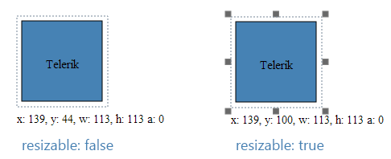
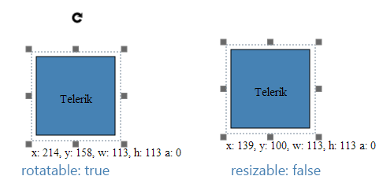
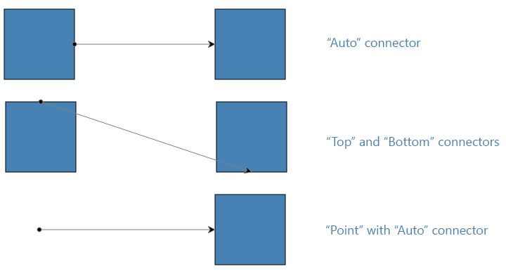

# kendo.dataviz.ui.diagram

## Configuration

### autoBind `Boolean` *(default: true)*

If set to `false` the widget will not bind to the data source during initialization. In this case data binding will occur when the [change](/api/framework/datasource#events-change) event of the
data source is fired. By default the widget will bind to the data source specified in the configuration.

> Setting `autoBind` to `false` is useful when multiple widgets are bound to the same data source. Disabling automatic binding ensures that the shared data source doesn't make more than one request to the remote service.

#### Example - disable automatic binding

	

	

### name `String` *(default: "Diagram")*

 *The name doesn't seem to be used or do anything, does it?*

### zoomRate `Number` *(default: 1.1)*

The scaling factor or the zoom when using the mouse-wheel to zoom in or out.

### dataSource `kendo.data.DataSource`

See the [dataSource field](#fields-dataSource).

### dragAndDrop `Boolean` *(default: false)*

 *Can't see where or how this one is being used.*

### template `String|Function`

The [template](/api/framework/kendo#methods-template) which renders the content of the shape when bound to a dataSource. The names you can use in the template correspond to the properties used in the dataSource. See the dataSource topic below for a concrete example.

### dataTextField `String`

 *Something to do with the underlying Kendo infrastructure?*

### resizable `Boolean` *(default: true)*

This defines whether the shapes can be resized. If set to false the adorner will not show the resizing thumbs, as can be seen below;

### rotatable `Boolean` *(default: true)*

This defines whether the shapes can be rotated. If set to false the adorner will not show the rotating thumb, as can be seen below;

### visualTemplate `Function`

A function returning a visual element to render for a given dataSource item. The following primitives can be used to construct a composite visual:

* Circle
* Rectangle
* Path
* Line
* Polyline
* TextBlock
* Image

 *Should redirect here to a more comprehensive overview of how to use the primitives.*

#### Example - how to use the visualTemplate

	var getVisual = function(data)
					{
					    var g = new kendo.diagram.Group({
					        autoSize: true
					    });
					    var r = new kendo.diagram.Circle({
					        width : 100,
					        height: 60,
					        background: "LimeGreen"
					    });
					    g.append(r);
					    var fn = new kendo.diagram.TextBlock({
					        text: data.name,
					        fontSize: 16,
					        x   : 30,
					        y   : 30
					    });
					    g.append(fn);
					    return g;
					}
	var options = {
	    dataSource: [
	        {
	
	            "name" : "Telerik",
	            "items": [
	                {"name": "Kendo"},
	                {"name": "Icenium"}
	            ]
	        }
	    ],
	    autoBind  : true,
	    visualTemplate  : getVisual
	};
	diagram = $("#canvas").kendoDiagram(options).data("kendoDiagram");
	diagram.layout(); 

### tooltip `Object`
### copy `Object`
### allowDrop `Boolean` *(default: true)*

## Fields

### dataSource `kendo.data.DataSource`

The [data source](/api/framework/datasource) of the widget. Configured via the [dataSource](#configuration-dataSource) option.

> Changes of the data source will be reflected in the widget.

> Assigning a new data source would have no effect. Use the [setDataSource](#methods-setDataSource) method instead.

#### Example - add a data item to the data source

    

    

#### Example - update a data item in the data source

 *Doesn't work right now, need to hook up or amend the update of the source.*

 	

    

#### Example - remove a data item in the data source

 *Same here, need to hook up or amend the update of the source.*
 

 	

    

### options `Object`

The [configuration](#configuration) options with which the diagram is initialized.

#### Example - changing the diagram options

    

    

## Methods

 *I have gone over all the methods in the code which are not marked as '_private', but it doesn't mean they should be public. We should clean up and decide/set/settle the method which should be private or public.*

### destroy

Prepares the widget for safe removal from the DOM. Detaches all event handlers and removes jQuery.data attributes to avoid memory leaks. Calls destroy method of any child Kendo widgets.

> This method does not remove the widget element from the DOM.

#### Example

    

### zoom

Zooms in or out of the diagram.

#### Parameters

##### zoom `Number`

The zoom factor.

##### staticPoint `Point`

The point to zoom into or out of.

### setDataSource

Sets the data source of the diagram.

#### Parameters

##### dataSource `kendo.data.DataSource`

The data source to which the widget should be bound.

### save

Saves the diagram.

### load

Loads a saved diagram.

#### Parameters

##### json `String`

The serialized diagram in JSON format.

### getValidZoom

Makes sure the zoom in within some valid bounds.

 *Probably not needed to be a public method*

#### Parameters

##### zoom `Number`

The zoom factor.

### pan

Pans the diagram with a specified delta (represented as a Point).

#### Parameters

##### pan `Point`

The translation delta to apply to the diagram.

### viewport

Returns the bounds of the diagramming canvas.

### transformMainLayer

 *Probably not needed to be a public method*

### transformPoint

Transforms a point from the main canvas coordinates to the non-transformed origin.

#### Parameters

##### p `Point`

An arbitrary point to transform to the diagram coordinate system.

### transformRect

Transforms a given rectangle to the diagram coordinate system.

#### Parameters

##### r `Rect`

The rectangle to be transformed.

### focus

Sets the focus on the diagram.

 *Something about scrolling which has to be cleared out or demonstrated.*

### clear

Clears the content of the diagram.

### connect

Creates a connection which can be either attached on both ends to a shape, half attached or floating (not attached to any shape). When a connection is (half) attached to a shape it happens through the intermediate Connector object. Connectors are part of a Shape's definition and you can specify the binding of a connection to a shape directly via the shape or via one of its connectors. If you specify a Shape as a connection's endpoint the Auto-connector will be used. This means that the endpoint of the connection will switch to the most convenient (in the sense of shortest path) connector automatically. If you specify a shape's connector as an endpoint for a connection the endpoint will remain attached to that given Connector instance.
Finally, if you wish to have a (half) floating connection endpoint you should specify a Point as parameter for the floating end. 

#### Parameters

##### source `Object`

The source definition of the connection. This can be a Shape, a Connector or a Point.

##### target `Object`

The target definition of the connection. This can be a Shape, a Connector or a Point.

##### options `Object`

 *Forward to the Connection Options here*

The options of the new connection. See the Connection's options.

#### Example - connecting two shapes using the Auto-connector

    

#### Example - connecting two shapes using the specific connectors

    

#### Example - creating a half-floating connection

    

Note that the Shape holds an indexed connectors collection. Instead of accessing a default or custom connector by means of the **getConnector("name-of-connector")** method you could use **connectors[index]** instead.

### connected

Returns whether the two given shapes are connected through a connection. 

#### Parameters

##### source `Shape`

A Shape in the diagram.

##### target `Shape`

A Shape in the diagram.

### addConnection

Adds the given Connection to the diagram.

#### Parameters

##### connection `Connection`

The Connection instance to be added to the diagram.

##### undoable `Boolean` *(default:true)*

Whether the addition should be recorded in the undo-redo stack. 

### addShape

### undo

### redo

### remove

### select

### toFront

### toBack

### bringIntoView

### getBoundingBox

### getOriginBoundingBox

### documentToCanvasPoint

### copy

### cut

### paste

### refresh

### findByUid

### refreshSource

### layout

### alignShapes

### randomDiagram

 *Useful for examples but otherwise not strictly necessary as a public method.*

### getId