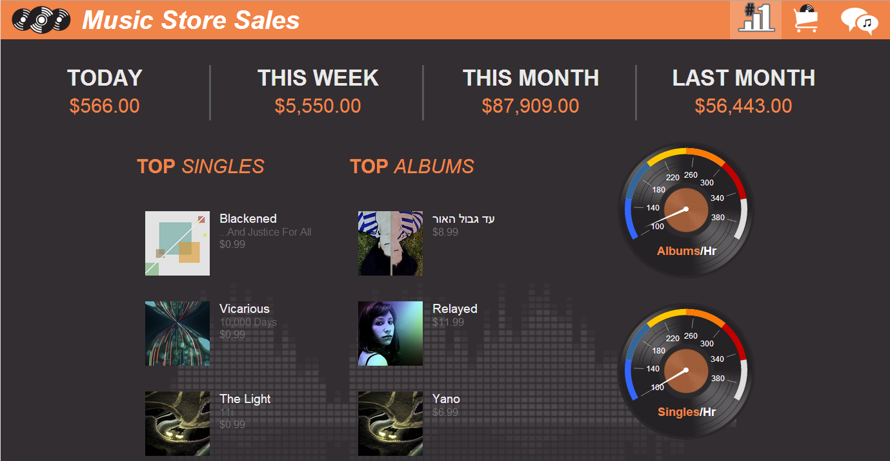

# Creating a Single-Page App with KendoUI - Music Dashboard

The Music Dashboard is constructed as a single page app, built to have smooth transitions and high performance. Using the Sammy.js framework, the various pages of the application are routed through this framework and in ASP.NET MVC.

## Initializing the application in MVC

We start with the basic ASP.NET MVC **HomeController.cs**:
	
	public class HomeController : Controller
	{
		public ActionResult Index()
		{
			return View();
		}
	}

**Index.cshtml** is reduced to a very skeletal structure:

	@{
		Layout = "~/Views/Shared/_Layout.cshtml";
	}
	

		

	

Each page of the app requires three components: an HTML page, a CSS stylesheet, and a JavaScript file. Additionally, a site-wide **Site.css**, **app.js**, and **main-view.js** are required. MVC provides the framework for the single page, but the plumbing must be included.

A large amount of the structure is therefore included in **_Layout.cshtml** (portions ommitted for brevity):

	<!DOCTYPE html>
	<html>
	<head>
		<link href="@Url.Content("~/Content/Site.css")" rel="stylesheet" type="text/css" />
		<link href="@Url.Content("~/Content/home-view.css")" rel="stylesheet" type="text/css" />
    	<link href="@Url.Content("~/Content/music-view.css")" rel="stylesheet" type="text/css" />
    	<link href="@Url.Content("~/Content/social-view.css")" rel="stylesheet" type="text/css" />
	</head>

	<body>
		@RenderBody()

        
        
        
    </body>

Obviously, there are also required references to various Kendo CSS (in **&lt;head&gt;**):

	<link href="@Url.Content("~/Content/themes/base/kendo.common.min.css")" rel="stylesheet" type="text/css" />
    <link href="@Url.Content("~/Content/themes/base/kendo.dataviz.min.css")" rel="stylesheet" type="text/css" />
    <link href="@Url.Content("~/Content/themes/kendo.moonlight.min.css")" rel="stylesheet" type="text/css" />
    <link href="@Url.Content("~/Content/themes/kendo.dataviz.moonlight.min.css")" rel="stylesheet" type="text/css" />

#Setup The Kendo SPA Plumbing

The Music Store Dashboard application is a simple JavaScript object named musicDashboard. It is defined in an 
anonymous function and added to the Window object:

    (function (window, undefined) {

        var musicDashboard = {

            // The Guts Go Here

        };

        return (window.musicDashboard = musicDashboard);

    }(window));

The musicDashboard object has a setup method that initilizes the router member to a new Kendo UI Router object.
The Router object allows you to define your application's URLs. This means they can be shared to provide deep linking to your application.
You can read more about the [Kendo Router](http://www.kendoui.com/blogs/teamblog/posts/13-05-09/a-day-at-the-spa-with-kendo.router.aspx "Kendo Router") object at http://www.kendoui.com/blogs/teamblog/posts/13-05-09/a-day-at-the-spa-with-kendo.router.aspx

        //kendoui router object
        router: undefined,

        setup: function () {

            this.router = new kendo.Router();

            //setup views
            this.setupRoutes();

            this.router.start();

        },

Each route must be defined and the Music Dashboard does this in a method called setupRoutes. Once the routes have been defined
the router is started by calling the start() method.

Each route is defined by a URL and a callback method. The URL is the route or value defined after the hash, #. Single Page Apps
rely on an old technique of using a # in a URL to define a unique URL. When the # value changes in a URL the browser does not 
send the request to the server, instead is looks for the target on the page, it also fires a 'hashchange' event. The Kendo Router
object is wired to the 'hashchange' event and executes the route's corresponding callback when the event fires. Here you see a truncated
callback method and routes defined for each view in the Music Dashboard application.

        //defined Routes for KendoUI
        setupRoutes: function () {

            var that = this;

            if (that.router) {

                that.router.route("/", function () {});

                that.router.route("/sales", function () {});

                that.router.route("/social", function () {});

            }

        },

The dashboard's route callbacks follow a common pattern; destroy any existing views (more about views in the next section),
make sure the top navigation has CSS classes applied correctly and finally create the target view.

                that.router.route("/", function () {

                    console.log("home");

                    //destroy other views or they will be markup artifacts on the screen
                    that.salesView.destroy();
                    that.socialView.destroy();
                    
                    $(".main-nav-item-selected").removeClass("main-nav-item-selected");
                    $(".main-nav-item-icon-selected").removeClass("main-nav-item-icon-selected");
                    $(".nav-music-icon").addClass("main-nav-item-icon-selected");
                    $(".nav-music").addClass("main-nav-item-selected");

                    that.createMainView();

                });

# Managing Views

The musicDashboard object's setup method calls another method, setupViews, to initilize the Kendo UI views:

        setup: function () {

            this.router = new kendo.Router();

            this.setupViews();
            this.setupRoutes();            

            this.router.start();

        },

The setupViews method initializes each view: main, social and sales by selecting the elements from the page and passing their
corresponding markup to the kendo.View 'constructor'. There is an additional, optional model parameter that can be provided, but
is not needed for the Music Dashboard. The Kendo Views are used to help manage swaping the main content between views as the user
navigates the application.

        //define views for KendoUI
        setupViews: function () {

            var that = this,
                sv = document.querySelector("#salesview"),
                socv = document.querySelector("#socialView"),
                mv = document.querySelector("#mainview");

            //outerHTML
            that.salesView = new kendo.View(sv.outerHTML);
            that.socialView = new kendo.View(socv.outerHTML);
            that.mainView = new kendo.View(mv.outerHTML);

        },

When a view is requested it's create method is called. For the Music Store Dashboard this is done in the router's callback 
methods. The non-active views are destroyed, which removes them from the DOM as well as clears variables used by the view.
When a view is displayed it is rendered. This is done by calling the view's render method and passing the selector of the 
view's parent element. For the Music Dashboard this is the #main element.

        createMainView: function () {

            var that = this;

            that.mainView.render("#main");

            //more functionality here
        },

# Page navigation

The various pages of the Music Dashboard are accessed through the nagivation strip along the top.

## Layout Placement

Because the Music Dashboard is a single-page app, for the navigation to be available on every page the strip must be placed in **_Layout.cshtml**. Each page other than the main must be placed in the **&lt;nav&gt;**.

	<header id="main-header">
        <nav class="main-nav">
            <a href="#"></a>
            <a href="#/sales"></a>
            <a href="#/social"></a>
        </nav>
	</header>

The **class** attributes in the **&lt;span&gt;** tags are defined in **Site.css**.

## Clicks and Routing

Because the routes are defined using the Kendo Router there is no real need to define click or touch event handlers to drive navigation.
Instead simple anchors <a href=""> are defined for each menu item that change the URL # value.